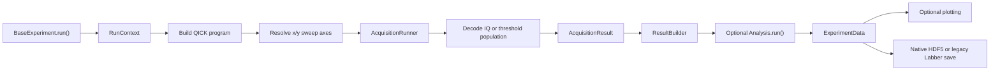

# Core execution workflow

`BaseExperiment.run()` owns the common experiment lifecycle. Experiment classes
provide a QICK program and sweep axes; core code handles acquisition, result
construction, optional analysis, plotting, and storage.

## Data contract

- `ExperimentData.raw_iq` is the primary trace used by analysis.
- `x_axis` and `y_axis` are sweep coordinates only.
- A multi-readout program keeps all readouts in `raw_data["readouts"]` with a
  leading `readout` dimension. `get_readout()` retrieves an index or named
  readout while preserving the single-readout API.
- `analysis_data` contains derived arrays such as fit curves, residuals, and
  verification populations; it is not a substitute for raw acquisition data.
- `dataset_dims` names every stored dataset dimension for native HDF5.

## Responsibility map

| Responsibility | Core module |
| --- | --- |
| Experiment lifecycle and public `run()` API | `base_experiment.py` |
| Run options, sweep resolution, dispatch, and result building | `experiment_components.py` |
| QICK acquisition and IQ/threshold decoding | `acquisition.py` |
| QICK program, pulse, measurement, and active-reset setup | `base_program.py`, `qubit_pulse.py` |
| Analysis lifecycle | `base_analysis.py` |
| Typed experiment result and compatibility helpers | `experiment_data.py` |

Specialized experiments may override acquisition when QICK returns a different
physical layout (for example decimated TOF, shots, mux channels, or two active-
reset readouts). They should still return `ExperimentData` and declare dataset
dimensions explicitly.
