# Core execution workflow

`BaseExperiment.run()` 負責完整的 experiment lifecycle。執行方式與 readout
方式是兩個獨立維度：`Direct`、`Live` 決定 acquisition 如何執行；
`Threshold` 只決定 acquisition data 如何解碼，因此也可以搭配 live plot。

```mermaid
flowchart LR
    User["BaseExperiment.run()"] --> Options["RunContext<br/>解析本次執行選項"]
    Options --> Program["build_program()<br/>建立 QICK Program"]
    Program --> Axes["SweepResolver<br/>解析 x / y axes"]
    Axes --> Execution{"Execution mode"}

    Execution --> Direct["Direct<br/>single acquire<br/>rounds = py_avg"]
    Execution --> Live["Live<br/>incremental acquire + render"]

    Direct --> Instrument{"Instrument sweep?"}
    Live --> Instrument
    Instrument -->|No| Single["Program acquisition"]
    Instrument -->|Yoko| OuterLoop["Yoko outer loop"]

    Single --> Readout{"Readout mode"}
    OuterLoop --> Readout
    Readout -->|IQ| IQ["Complex IQ values"]
    Readout -->|Threshold| Threshold["Discriminated population"]

    IQ --> Acq["AcquisitionResult"]
    Threshold --> Acq
    Acq --> Builder["ResultBuilder<br/>fit + metadata + dimensions"]
    Builder --> Analysis["Analysis.run()"]
    Analysis --> Result["ExperimentData"]

    Result --> Plot["Plotting<br/>independent and optional"]
    Result --> Storage["HDF5 / Legacy Labber<br/>independent and optional"]
```

## Responsibility map

| Responsibility | Core module |
| --- | --- |
| Experiment lifecycle and public `run()` API | `base_experiment.py` |
| Run options, sweep resolution, execution dispatch, result building | `experiment_components.py` |
| Shared QICK acquisition and IQ/threshold decoding | `acquisition.py` |
| QICK program setup and pulse sequence base | `base_program.py`, `qubit_pulse.py` |
| Analysis lifecycle | `base_analysis.py` |
| Typed experiment result | `experiment_data.py` |

The execution branches converge on `AcquisitionResult`, so fitting, analysis,
plotting, and storage do not need separate threshold-specific paths.
