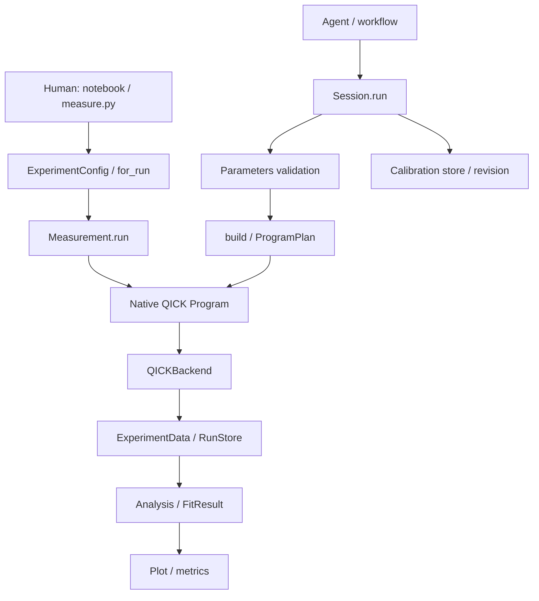

# QickworkspaceV2 重構說明：從目錄到每一次量測

本文件對應目前重構後的專案，說明改了什麼、各層負責什麼，以及日常最常用的 API 實際做了哪些事。說明使用繁體中文；目前使用的兩本 Notebook，其標題、說明、程式註解與提示字串使用英文。

最先需要知道的三件事：

1. **日常量測用 `Measurement.run(Program, run_cfg)`。** 直接編輯原生 QICK program 與字典，不必寫參數 schema 或 `build()`。
2. **`for_run()` 只準備設定，不會量測。** 它複製工作值，再覆蓋本次參數，回傳可繼續編輯的 `RunConfig`。
3. **驗證工具集中在 `tests/`。** 原本的 `scripts/` 目錄已移除，日常量測直接使用根目錄 Notebook 或 `measure.py`。

## 1. 這次具體改了什麼

| 範圍 | 重構後的安排 | 對使用者的影響 |
|---|---|---|
| 專案目錄 | 實驗室設定放 `lab/`，可安裝的 SDK 放 `QickworkspaceV2/`，原始版本保留在 `archive/v1/` | 日常改實驗與維護共用工具有明確位置 |
| 設定 | 拆成接線／初始 device schema、Python 工作設定、本次量測設定 | 不用每改一次 gain 就回頭修改 YAML 或 schema |
| 設定 API | 新增 `config_all["Q1"]`、批次 `update()`、`update_all()`、`for_run()` | 少寫重複 qubit 名稱，區分持續工作值與單次覆寫 |
| 設定入口 | 使用 `config_all["Q1"]`、`qb.update(...)`、`for_run(...)` 與一般字典更新 | 固定 qubit ID、工作值與執行副本分開 |
| QICK program | `BaseProgram` 繼承 `AveragerProgramV2`，保留 `_initialize`／`_body`、pulse、loop、delay | 原生程式仍然是實驗時序的來源 |
| Gate 使用 | 提供 `qb.x()`、`qb.halfx()`、其他單 qubit gate 與明確的 `parallel()` | 不想碰 envelope 的使用者也能寫實驗 |
| 多 qubit | 固定 qubit ID、generator、digital ADC、readout group、MUX tone slot | 同一套流程可選 Q1、Q2 或更多 qubit，資料不靠位置猜對應 |
| 實驗粒度 | 28 個實驗分成獨立檔案，GE／EF 各自擁有 program 和分析入口 | 可獨立改 `t1_ge.py`，不必連帶修改 `t1_ef.py` |
| 日常執行 | 新增直接接受 `Program + run_cfg` 的 `Measurement` | 直接使用改好的參數，不重新跑 recipe build |
| 自動化 | 保留 `Session + ExperimentSpec`，提供參數驗證、校正與 worker | Blueprint 可以用簡單參數呼叫同一個 native program |
| 資料 | 使用帶有 dims、coords、units 的複數 IQ 與 shots | 保留多 ADC、多 readout event、多維掃描與 shot 對應 |
| Fitting／plot | 分成資料、數學模型、分析結果與繪圖 | 分析失敗仍可保存並重讀原始量測 |
| 校正 | 工作字典與持久 calibration store 分開；store 使用 proposal、revision | 不會因為量到一個 extrema 就暗中覆寫正式校正 |
| 儀器掃描 | DC／TWPA 各流程獨立，綁定實際儀器 read/write | 保存 readback，並處理結束與失敗時的恢復 |
| Notebook／腳本 | 根目錄 `QickworkspaceV2.ipynb`、`measure.py`；進階流程另一本 notebook | 有可直接修改並上機的入口 |
| 模擬 | 移除執行用的模擬 backend、MODE switch 與舊生成式範例 | `run()` 走實際 QICK acquisition |
| 清理 | 移除快取、舊建置輸出、下載參考副本、重複示範、未使用的 wrapper 與過時文件 | 保留 `.venv`、原始封存、真實量測資料與必要測試檔 |
| 時序修正 | gate helper 與 GE→EF 銜接增加一個 tProc timing tick 的等待餘裕 | 更改 sigma 後，避免不同時鐘量化讓相鄰 pulse 重疊 |

V2 使用原生 program 編寫方式、固定 qubit ID 與 editable flat config。量測入口是 `Measurement`／`Session`，結果使用 `ExperimentData`。SDK 不提供 V1 相容層，也不 import `qick_workspace` 或 `archive`。

設定由明確選定的 profile 或以 qubit ID 為 key 的 mapping 建立，不接受舊式分區 `config_list`。ABCD／AC Stark／temperature 等專用求解流程目前留在原始封存，沒有全部登錄成新 SDK 實驗；目前可直接呼叫的範圍以第 15 節的 28 個實驗為準。

## 2. 目錄怎麼看

```text
QickworkspaceV2_proj-main/
├── QickworkspaceV2.ipynb          每天使用的量測 notebook
├── measure.py                    每次執行一個指定實驗的 Python 腳本
├── Readme.md                     簡短使用入口
├── pyproject.toml                套件、依賴、CLI 與測試設定
├── requirements.txt              日常硬體／Notebook 環境
├── requirements-tested.txt       曾驗證環境的依賴版本
├── lab/
│   ├── config.py                 可直接編輯的 Python 工作設定
│   ├── project.yaml              選 profile、連線、資料位置、run defaults
│   ├── profiles/
│   │   ├── direct/               獨立讀出：hardware.yaml + device.yaml
│   │   └── mux/                  多 tone 共用讀出：hardware.yaml + device.yaml
│   ├── procedures/               DC flux、TWPA power/frequency/flux 流程
│   └── blueprint_scripts/        給 NVIDIA discovery 使用的 wrappers
├── notebooks/
│   └── advanced_measurements.ipynb
├── QickworkspaceV2/               共用 SDK
│   ├── device/                   接線模型、editable config
│   ├── programs/                 BaseProgram、gate、Sweep
│   ├── experiments/              各自獨立的實驗檔案
│   ├── backends/                 真正 QICK compiler／acquisition
│   ├── data/                     IQ、HDF5、run journal、analysis revision
│   ├── analysis/                 fitting、readout classifier、resonator 等
│   ├── plotting/                 Figure 與 LivePlot
│   ├── runtime/                  Measurement、Session、worker、儀器掃描
│   ├── calibration/              store、proposal、dependency graph
│   ├── integrations/             NVIDIA adapter、worker client
│   └── instruments/              儀器 drivers
├── tests/                        單元測試、編譯／合約驗證工具與 compiler fixture
├── docs/                         使用與架構文件、驗證紀錄
├── data/                         實際 run 自動建立的資料
├── archive/v1/                   重構前原始版本
└── .venv/                        目前可使用的 Python 環境
```

### `scripts/` 是不是不用？

**不需要獨立的 `scripts/` 目錄，已移除。** 原本兩支工具有實際驗證用途，現在集中到 `tests/`：

| 工具 | 做什麼 | 何時用 | 會不會量測 |
|---|---|---|---|
| `tests/verify_notebooks.py` | 檢查 notebook 格式與語法；以真正 QICK compiler 編譯主 notebook 的 program/config 與 `measure.py` 設定 | 改 notebook、program、config helper 後 | 不連線，不執行 acquisition 格 |
| `tests/verify_blueprint.py` | 用提供的 NVIDIA core 原始碼驗證 wrapper discovery、JSON、array、PNG 與儲存合約 | 改 Blueprint adapter／wrapper 後 | 不連線，使用明確的數值資料 fixture 測合約 |

三種名稱容易混淆：

- 根目錄 **`measure.py`** 是人直接執行的量測腳本。
- **`lab/blueprint_scripts/`** 是讓 agent 發起實際量測的 wrappers，會呼叫 worker。
- **`tests/`** 是檢查前述功能的測試與維護工具。

SDK、`measure.py` 和正式 notebook 不依賴 `tests/` 執行量測。保留驗證工具是為了日後修改實驗時，能檢查編譯、資料與橋接是否仍正確。

驗證工具會使用額外依賴。Notebook checker 需要 QICK、nbformat 與 `tests/fixtures/qick_testbench.json`；Blueprint checker 需要本機提供官方 core 目錄，不會自行下載。後者會在 `.test-data/` 產生合約測試產物，並更新驗證報告。

### 清掉了哪些不必要的檔案？

- `lab/experiments/custom_t1.py` 和該目錄的初始化檔：重複的示範。正式 T1 GE／EF 已各有獨立模組；自訂 pulse／gate Program 範例保留在主 Notebook，方便直接修改。
- `experiments/object_api.py` 與 `experiments/contracts.py`：沒有執行入口依賴的包裝與轉匯出層。公開型別直接從實際定義的模組匯出，移除未使用的 `BaseExperiment` wrapper。
- 舊架構、authoring、migration 文件、Notebook 導覽頁：內容整合到本文件與根目錄 README，避免維護多份互相過時的說明。
- 重構前的設計審查報告和歷史清理清單：已由目前架構說明取代；真正 compiler、Notebook 和 Blueprint 的驗證紀錄仍保留。
- 維護產生的快取與暫存輸出：完成檢查後清除。

`lab/blueprint_scripts/` 的 28 個 wrappers 是 NVIDIA discovery 的入口，`lab/procedures/` 是可執行的儀器流程，兩者都有用途。`archive/v1/` 則保留原始實驗與資料作為遷移查閱來源；新 SDK 不會載入它。

## 3. 整體架構：兩個入口，共用 native program



日常開發已經有完整 `run_cfg`，因此 `Measurement` 直接編譯。Agent 通常只有 `target="Q1", start=0.02, stop=2.0, points=81`，由 `Session` 驗證後交給 `build()` 轉換。

兩者共用 `TimeRabiGEProgram` 這類真正的 QICK 程式，以及 backend、資料格式與分析工具。不存在一份人用的 pulse sequence 和另一份 agent 用的 pulse sequence。

| 項目 | `Measurement` | `Session` |
|---|---|---|
| 主要對象 | 即時改實驗的人 | 參數化流程、校正 graph、worker／agent |
| 輸入 | Program class、完整 editable `run_cfg` | experiment ID／Spec、簡單參數 |
| 是否呼叫實驗的 `build()` | 否 | 是 |
| 是否需要 Parameters schema | 否 | 是 |
| 設定來源 | 使用者傳入的 run_cfg | device profile + calibration snapshot + defaults + build |
| 分析 | 內建 Program 自動尋找 analyzer；自訂可明確傳入 | 使用 ExperimentSpec.analyze |
| 校正 store | 不自動讀寫 | 讀 snapshot；以明確 commit 更新 |
| 保存 | request、resolved config、assembly、acquisition、analysis | 同類資料，另有 device／calibration／recipe 紀錄 |

直接開發實驗只需繼承 `BaseProgram`。自動化使用 `ExperimentSpec` 描述參數、build 和分析，不再另設 `BaseExperiment` 包裝層。

## 4. 三種設定，各有不同生命週期

### 4.1 接線與初始值：`project.yaml`、`hardware.yaml`、`device.yaml`

`project.yaml` 選擇 hardware／device 檔案，也包含 Pyro 連線、資料目錄、calibration DB 和 averaging defaults。

`hardware.yaml` 描述 logical generator 對應的 channel、Nyquist zone、RFDC mixer、gain limit，以及 digital ADC endpoint。

`device.yaml` 描述 qubit ID、GE／EF transition、pulse 初始值、readout membership、MUX slot、coupler。它們使用 Pydantic 驗證，例如不存在的引用、重複通道、無效型別和不合法欄位。

這些檔案適合設定接線、初始裝置與可重現的起點。範例 profile 不是自動偵測結果，也不是本次實測校正。

### 4.2 工作設定：`config_all`

```python
from lab.config import make_config

config_all = make_config()
qb = config_all["Q1"]
qb.update(res_gain_ge=0.15, sigma_ge=0.02)
```

`make_config()` 讀取專案起點，再套用 `lab/config.py` 裡的 Python edits。呼叫它會建立一份新的工作設定，不會連線或量測。重新執行 `config_all = make_config()` 會替換這個變數；未存檔的舊工作值不會自動回來。

`config_all` 可理解為「目前這次 Python 工作階段的每顆 qubit 參數表」。工作值放在記憶體，更新它不等於寫回 YAML，也不等於 commit calibration。

### 4.3 本次設定：`run_cfg`

```python
from qick.asm_v2 import QickSweep1D

run_cfg = qb.for_run(
    steps=101,
    qb_freq_ge=QickSweep1D("freqloop", 2850, 2900),
    relax_delay=200,
)
```

這是某一次實驗要使用的副本。掃描範圍、暫時測試的 gain、readout_wait 等適合放在這裡。之後修改 `run_cfg`，不會改掉已複製來源的工作設定。

`run_cfg` 尚未對硬體做任何事。只有送入 `lab.run(...)` 才開始 acquisition。

## 5. `for_run()` 詳細解釋

原始碼在 `device/editable.py`。這個名稱表示「準備給一個 run 使用的設定」。回傳物件仍然可以改，並不是不可變物件。

### 5.1 `qb = config_all["Q1"]` 得到什麼？

得到 Q1 工作值的 **live view**。因此：

```python
qb = config_all["Q1"]
qb.update(res_gain_ge=0.15, res_sigma=0.01)
assert config_all["Q1"]["res_gain_ge"] == 0.15
```

`qb` 和 `config_all["Q1"]` 操作同一份工作值，不是兩份互不相關的字典。讀單一欄位使用 `qb["res_gain_ge"]`，也可以 `dict(qb)` 查看目前所有欄位。

如果後來重新賦值 `config_all = make_config()`，原先的 `qb` 仍指向舊物件，應重新執行 `qb = config_all["Q1"]`。只改 `qubit = "Q2"` 也不會讓舊 `qb` 自動切換到 Q2。

### 5.2 `qb.for_run(**overrides)` 的步驟

1. 依固定 qubit ID 取出目前工作值。
2. 深層複製這些值，避免既有 nested dict／list 共用而互相污染。
3. 附上目前完整的 readout-group context；MUX 子集合也保留原有 tone slots。
4. 套用你傳入的 keyword overrides。
5. 回傳 `RunConfig`。

對照概念程式碼：

```python
run_cfg = config_all.for_run("Q1")
run_cfg.update(steps=101, relax_delay=0)
```

它與下面的日常寫法有相同用途：

```python
run_cfg = config_all["Q1"].for_run(steps=101, relax_delay=0)
```

### 5.3 更新發生在哪一份設定？

```python
qb = config_all["Q1"]
qb.update(res_gain_ge=0.15)

run_a = qb.for_run(res_gain_ge=0.12)
run_b = qb.for_run()

assert qb["res_gain_ge"] == 0.15
assert run_a["res_gain_ge"] == 0.12
assert run_b["res_gain_ge"] == 0.15

qb.update(res_gain_ge=0.20)
assert run_a["res_gain_ge"] == 0.12
assert run_b["res_gain_ge"] == 0.15
assert qb.for_run()["res_gain_ge"] == 0.20
```

已經建立的 run 不會跟著之後的工作值修改而改變。要使用新值，就重新 `for_run()`，或明確修改那份 run。

### 5.4 既有值會深層複製，傳入的 overrides 會直接套用

`QickSweep1D` 保持原生 Python 物件，不會在 `for_run()` 變成 JSON、字串或 numpy array。這讓 QICK compiler 能直接處理 sweep。

目前實作對 `**overrides` 使用字典更新，因此若把同一個外部可變 list／dict 作為 override 傳給兩個 run，那個外部物件仍可能被共用。需要隔離時，分別建立物件或自行 `deepcopy`。常見的數值參數和每次新建的 `QickSweep1D(...)` 不需要多寫處理。

### 5.5 `RunConfig` 和普通 dict 的差別

| 行為 | `RunConfig` |
|---|---|
| `cfg["key"]`、`.get()`、`.update()` | 與字典相近，可用 keyword 或 iterable pairs 更新 |
| 自訂欄位 | 允許；program 必須實際讀取它才有作用 |
| `.copy()` | 深層複製，而不是內建 dict.copy 的淺層複製 |
| `.for_run(**overrides)` | 以目前這份 run 再複製一份，套用新的 overrides |
| 欄位名稱 | 直接使用原生 key，不做拼字或分區名稱轉換 |
| `.groups` | 保存額外 readout context，尤其用於 MUX |

不要把 `dict(run_cfg)` 當成完全等價的量測設定替代品：它會丟掉 `.groups`。檢視時可轉 dict；傳給量測時保留 `RunConfig` 或使用 `.copy()`。

### 5.6 `config_all.for_run(...)` 與 `qb.for_run(...)`

```python
# One qubit: a flat RunConfig.
single = config_all.for_run("Q1", steps=81)

# Several qubits: a RunConfig with per-qubit settings.
pair = config_all.for_run("Q1", "Q2", steps=81)
pair["qubits"]["Q2"].update(res_gain_ge=0.10)
```

多 target 的頂層含 `targets`、`qubits`、符合選取 endpoints 的 `couplers` 和共用 run controls。每顆 qubit 的 pulse／readout 參數位於 `qubits`。

未明確覆寫的 `reps`、`relax_delay`、`soft_avgs`、`steps` 等共用值，目前取自**第一個選取的 qubit**。要讓順序不影響共同設定，就先 `update_all(...)`，或在多 qubit 的 `for_run(...)` 明確傳入。

`for_run()` 不會把所有單顆 qubit 的任意自訂 key 自動搬到多 qubit 設定的頂層。全序列共用的自訂控制值，請像 `wait_us=...` 一樣直接傳給這次多 qubit `for_run()`。

### 5.7 `for_run()` 不負責的事

它不連線、不編譯、不執行 pulse、不 fit、不存檔、不 commit calibration，也不全面驗證實驗物理有效性。它會檢查 target 選取等基本條件；更完整的通道、gain、pulse、axis 檢查發生在 compile／run。

## 6. 設定 API 快查與優先順序

| 呼叫 | 修改範圍 | 回傳 | 立即寫檔 |
|---|---|---|---|
| `config_all["Q1"]` | 不修改；取得 live view | Q1 工作 view | 否 |
| `qb.update(a=1, b=2)` | Q1 工作設定 | `None` | 否 |
| `config_all.update_all(a=1)` | 所有已配置 qubit 的工作設定 | config_all | 否 |
| `config_all.for_run("Q1", a=1)` | 不修改來源；覆蓋副本 | 獨立 RunConfig | 否 |
| `qb.for_run(a=1)` | 不修改來源；覆蓋副本 | 獨立 RunConfig | 否 |
| `run_cfg.update(a=1)` | 僅該份 run_cfg | `None` | 否 |
| `config_all.save(path)` | 保存工作值、readout context、couplers | Path | 是，寫指定 YAML |
| `ExperimentConfig.load(path)` | 讀取已存工作值 | 新 ExperimentConfig | 否 |

`update()` 回傳 `None` 的形式不要寫成 `run_cfg = run_cfg.update(...)`，否則變數會變成 `None`。

日常入口的數值大致依此順序覆蓋：

```text
profile 初始值 / project defaults
    → lab/config.py 的 edits
    → notebook 內的工作值 edits
    → for_run 的 overrides
    → run_cfg 後續 edits
    → Program 明確定義的實驗行為
```

最後一項很重要：`TimeRabiGEProgram` 在 program 裡明確使用 constant pulse。修改一個沒有被 program 使用、或被明確參數覆蓋的 key，不會自動改變波形。

量測參數直接使用原生 key：

| Key | 說明 |
|---|---|
| `res_sigma` | direct readout envelope 的 sigma |
| `wait_us` | 等待時間；可為 QickSweep1D |
| `detuning_mhz` | Ramsey 第二個 pi/2 pulse 的 phase-ramp rate |

Editable config 和送進 program 的 resolved cfg 都使用相同欄位名稱，例如 `cfg["wait_us"]`。欄位名稱不會自動改寫，也不會剝除 `qb.` 等分區前綴。

任意其他拼錯的 key 不會都被偵測：寬鬆字典刻意容許自訂實驗參數。檢查實驗是否讀取該欄位、查看編譯的 pulse 參數，才能確認改動確實生效。

## 7. 為什麼有 `build(ctx, p)`？

**`build()` 是目前 `Session`／Blueprint 路徑的轉接點。QICK 本身不要求它，直接 Notebook 路徑也不呼叫它。**

Agent 常傳來這種容易驗證、容易序列化的要求：

```python
session.run("time_rabi_ge", target="Q1,Q2", start=0.02, stop=2.0, points=81)
```

但 QICK program 還需要 channel、mixer、每顆頻率、readout group、pulse length sweep、迴圈數量等。`Session` 先取得目前裝置與 calibration snapshot，再呼叫 `build()`，把要求轉成完整計畫。

### 7.1 你貼的範例

```python
def build(ctx, p):
    cfg = ctx.config("ge")
    cfg["steps"] = p.points
    axis = Sweep("length", p.start, p.stop, p.points, "us", "sweep", "length", "{target}__qb_pulse")
    for qc in cfg["qubits"].values():
        qc["pulse_type_ge"] = "const"
        qc["qb_length_ge"] = axis.qick()
    return ProgramPlan(TimeRabiGEProgram, cfg, (axis,))
```

| 程式片段 | 實際責任 |
|---|---|
| `ctx` | `BuildContext`：本次選取 targets、已套用 calibration 的 Device、run defaults |
| `p` | 已通過 `TimeRabiGEParameters` 驗證的參數物件，包含 start、stop、points、target |
| `ctx.config("ge")` | 建立這些 targets 的 GE 執行設定，含每顆 qubit、相關讀出群組／couplers、reps、relax_delay |
| `cfg["steps"] = p.points` | 把公開介面的 points 轉成 program 使用的 steps |
| `Sweep(...)` | 記錄掃描的名稱、範圍、單位、loop 與實際 pulse 參數對應 |
| `for qc ...` | 把同一個 duration 掃描套用到本次每一顆 qubit |
| `pulse_type_ge = "const"` | 在設定中表明此實驗選用 constant pulse |
| `qb_length_ge = axis.qick()` | 建立原生 QickSweep1D，讓 QICK 編譯硬體 sweep |
| `ProgramPlan(...)` | 把 Program class、cfg、資料軸資訊交回 Session；此時還沒有 acquisition |

此處 `pulse_type_ge="const"` 與目前 `TimeRabiGEProgram._initialize()` 裡明確的 `pulse_type="const"` 有重複表達。實際 pulse 以 Program 的宣告為準；只改 build 的這一行，不會讓 Time Rabi 變成 Gaussian。這一行不是建立 build 抽象層的理由，build 的主要價值是參數轉換與明確資料契約。

### 7.2 `Sweep(...)` 的八個參數

這個例子若改成 keyword 寫法，意思較清楚：

```python
axis = Sweep(
    name="length",              # Name in saved data / plots.
    start=p.start,
    stop=p.stop,
    points=p.points,
    unit="us",
    loop="sweep",               # Native QICK loop name.
    parameter="length",         # Native pulse parameter to query.
    pulse="{target}__qb_pulse",  # Q1__qb_pulse, Q2__qb_pulse, ...
)
```

`axis.qick()` 產生 `QickSweep1D("sweep", p.start, p.stop)`。點數由 program 的 loop 提供；QickSweep1D 本身不是一條預先算好的 numpy 座標陣列。

`name` 是保存資料的 dimension 名稱，`loop` 是 QICK 的 loop 名稱，兩者可以不同。`parameter` 和 `pulse` 告訴 backend 去哪裡讀編譯後的實際座標，因此最終資料軸不直接假設等於原始 `linspace`。

對等待時間，改成 time tag binding，例如 `parameter="t", tag="evolution"`。`Sweep` 要在 pulse 與 tag 二選一。

### 7.3 `ProgramPlan` 是什麼？

它是一個小型資料容器：

| 欄位 | 用途 |
|---|---|
| `program` | 要建立的 native Program class |
| `cfg` | 本次完整設定 |
| `sweeps` | 有順序的資料軸 bindings |
| `readout_events` | 每個 rep 裡 readout 的語意名稱 |
| `capture_shots` | 是否保留逐次 shots |
| `metadata` | 例如 host sweep 或 decimated acquisition 等執行選項 |

它不會自己連線、compile 或 acquire。`Measurement` 內部也會使用 ProgramPlan 與 backend 溝通，但不要求日常使用者自己建立它。

### 7.4 直接 Notebook 為什麼可以省略 `build()`？

因為你已經自己寫好完整 `run_cfg`：

```python
from qick.asm_v2 import QickSweep1D
from QickworkspaceV2.experiments.time_rabi_ge import TimeRabiGEProgram

run_cfg = config_all["Q1"].for_run(
    steps=81,
    qb_length_ge=QickSweep1D("sweep", 0.02, 2.0),
    qb_gain_ge=0.15,
)
result = lab.run(TimeRabiGEProgram, run_cfg, py_avg=5)
```

`Measurement` 由實際 compiler 的 loop、pulse parameters、time tags 推導一般資料軸。它不先把 cfg 轉回 Parameters 再重新 build，因此不會用 recipe defaults 蓋掉你的 edits。

複雜實驗若有多個可能的 X 軸、額外迴圈或不同 pulse 命名，應傳 `axes=[Sweep(...)]` 明確指定。自動推導不是所有自訂 program 的通用解析器。

### 7.5 什麼時候才需要維護 build？

| 你正在做的事 | 要不要 build |
|---|---|
| 在 notebook 改 gain、sigma、頻率、時間 | 不需要 |
| 在 notebook 自己寫 Program class | 不需要 |
| 使用內建 Program 搭配自己的 analyzer | 不需要 |
| 把實驗登錄成 Session 可呼叫的 ID | 目前 Spec contract 需要 |
| 讓 Blueprint 只傳 start／stop／points 來呼叫 | 由 build 轉換成完整 cfg |
| 改 agent 可見的參數名稱、defaults、驗證規則 | 需要同步 Parameters 和 build |

這是一個取捨：自動化路徑多維護一個小函式，換取明確、可驗證的對外參數。純人工作業可以只維護 Program。物理 sequence 應持續放在 `_initialize`／`_body`，不要把 build 寫成另一份 sequence。

## 8. `lab.run()` 從頭到尾做了什麼

`lab` 在主 Notebook 裡是 `Measurement`。建立方式：

```python
from QickworkspaceV2 import Measurement
from lab.config import CONNECTION, DATA_PATH

lab = Measurement.from_pyro4(**CONNECTION, data_path=DATA_PATH)
soc, soccfg = lab.soc, lab.soccfg
```

這一步會連線、取得硬體 config，也會初始化資料目錄／run journal。它沒有執行量測 sequence。

`lab.run(Program, run_cfg, py_avg=5)` 的主要流程：

1. 檢查連線和平均次數，建立 run ID 與 request 紀錄。
2. 取得此連線的 lock，以及跨程序的硬體 resource lease。
3. 複製／整理 cfg，檢查通道和 gain，建立真正 QICK Program 並編譯。
4. 檢查 readout 數量、ADC 對應與資料軸，保存編譯 assembly 和 resolved config。
5. 逐輪呼叫 QICK acquisition，把 ADC 資料整理成每顆 qubit 的 named traces。
6. 每輪保存 partial；有 `on_progress` 時傳出目前平均結果。
7. 完成後先保存 immutable acquisition，再執行 analyzer。
8. 保存 analysis revision，回傳 `ExperimentData`。

| 參數 | 行為 |
|---|---|
| `program` | Program class，例如 T1GEProgram，不是先建好的 instance |
| `run_cfg` | 已編輯好的設定 |
| `py_avg` | 軟體 acquisition 輪數；省略時取 run_cfg 的 soft_avgs，否則預設 1 |
| `axes` | 省略時推導一般軸；自訂時提供 Sweep bindings |
| `analyze="auto"` | 內建實驗自動使用自己 module 的 analyzer；自訂 Program 預設沒有 analyzer |
| `analyze=None` | 保存 acquisition，不執行分析 |
| `analyze=my_function` | 使用指定 analyzer |
| `iq_process` | 本次訊號分析模式；未指定時取 run_cfg，預設 abs |
| `capture_shots` | single_shot 預設開啟；其他實驗可明確開啟 |
| `readout_events` | 自訂 readout 名称，數量必須符合編譯的 triggers |
| `on_progress` | 收到 partial／完成結果的 callback；可使用 LivePlot |
| `cancel` | 使用 threading.Event 在 acquisition 輪次之間合作取消 |

內建 `single_shot` 的直接入口預設 events 為 ground／excited。一般直接 Program 未指定時使用 readout_0、readout_1 等名稱；Session 則以 ProgramPlan 指定的名稱為準。

`lab.compile(Program, run_cfg)` 只編譯，回傳 Program，並更新 `lab.last_program`。它不會建立一個 acquisition run；但建立 `lab` 時資料 journal 已初始化。完整資料軸與 readout contract 檢查還會在 `run()` 的 acquisition 前進行。

## 9. Pulse-level 與 gate-level 如何共存

### 原生 pulse-level

```python
from QickworkspaceV2 import BaseProgram

class MySpecProgram(BaseProgram):
    def _initialize(self, cfg):
        self.setup_resonator(cfg)
        self.setup_qubit_gen(cfg, "ge")
        self.add_loop("freqloop", cfg["steps"])
        self.setup_qb_pulse(cfg, "ge", name="qb_pulse", pulse_type="flat_top")

    def _body(self, cfg):
        self.pulse(ch=cfg["qb_ch"], name="qb_pulse", t=0)
        self.delay_auto(cfg["readout_wait"])
        self.measure(cfg)
```

`readout_wait` 可直接放進 `for_run(readout_wait=0.05, ...)`。框架不要求為它增加 schema。

### Gate-level

```python
class MyGateProgram(BaseProgram):
    def _initialize(self, cfg):
        self.setup_device(cfg, gates=True)

    def _body(self, cfg):
        with self.parallel():
            for qb in self.qubits.values():
                qb.halfx()
        self.delay_auto(cfg["free_evolution_us"])
        with self.parallel():
            for qb in self.qubits.values():
                qb.x()
        self.measure(cfg)
```

此處的 `qb` 是 program 內的 **gate handle**；前面 `qb = config_all["Q1"]` 是 **設定 view**。兩者只是範例變數同名，型別與用途不同：前者有 `x()`，後者有 `update()`／`for_run()`。

一般 gate 呼叫接續執行，`parallel()` 才是同時 pulse layer。它們最終都呼叫原生 QICK pulse／delay。`wait_pulses()` 在活動 pulse/readout 結束後保留一個 tProc timing tick，避免不同 clock 的量化產生重疊；原生 `delay_auto()` 的行為仍可直接使用。

Qubit gate 的振幅、shape、sigma 來自校正 pulse。若 Power Rabi 用 sigma=0.02 測得 pi_gain，後續 gate 也應保留同一組 envelope 設定；不能只更新 gain，卻改回另一個 sigma。

### 常用 pulse 參數

| 參數 | 意義 |
|---|---|
| `qb_freq_ge`／`qb_freq_ef` | GE／EF drive frequency，MHz，可為原生 sweep |
| `qb_gain_ge`／`qb_gain_ef` | 探測或 Rabi pulse gain |
| `pi_gain_ge`／`pi2_gain_ge` | GE gate 使用的 pi／pi/2 gain；EF 有自己的對應欄位 |
| `pulse_type_ge`／`pulse_type_ef` | helper 使用的 const／arb／flat_top，除非 Program 明確指定 |
| `shape_ge`／`shape_ef` | gauss、cosine、drag 等 envelope shape |
| `sigma_ge`／`sigma_ef` | Gaussian／DRAG envelope 的 sigma，us |
| `length_mult_ge`／`length_mult_ef` | envelope 長度的 sigma 倍數 |
| `qb_length_ge`／`qb_length_ef` | constant pulse 的長度 |
| `qb_flat_top_length_ge`／`qb_flat_top_length_ef` | flat-top pulse 的平台長度，不包含兩側 envelope |
| `res_freq_ge`／`res_gain_ge` | 讀出頻率／gain；名稱沿用 flat config 慣例 |
| `res_pulse_type` | direct readout 的 const／arb／flat_top |
| `res_sigma` | direct shaped readout 的 envelope sigma；const 不使用 |
| `res_length` | constant 長度，或 flat-top 平台長度 |
| `ro_length` | ADC integration duration |
| `trig_time` | readout trigger offset |
| `ro_phase` | 軟體 IQ rotation 用的角度，不是發射端的 `res_phase` |
| `qb_mixer`／`res_mixer` | RFDC mixer 設定；不是外部 LO 的自動換算 |

## 10. 多 qubit、MUX 與資料對應

```python
run_cfg = config_all.for_run(
    "Q2", "Q1",
    steps=81,
    wait_us=QickSweep1D("waitloop", 0, 100),
    reps=100,
    relax_delay=200,
)
run_cfg["qubits"]["Q2"].update(res_gain_ge=0.10)
```

這會按選取順序回傳 targets，但 Q2 不會因排在第一個就被誤認成 ADC0。Backend 根據 compiled program 的 readout declaration，再用每顆 `ro_ch` 找出實際位置。

編譯 helper 會把單 qubit flat cfg 或多 qubit cfg 整理成內部視圖，含 `targets`、`qubits`、`readout_groups`。多 qubit pulse 名稱如 Q1__qb_pulse／Q2__qb_pulse，避免重名；單 qubit 原生 authoring 仍可使用 qb_pulse／myro 這类短名稱。

Direct readout 的每個 group 對應自己的讀出 generator。MUX group 共用 generator，保留完整 tone list 與固定 slot，只播放選取的 mask。同 group 的共用 length、integration、trigger 必須一致。

MUX tone registers 與部分 PYNQ readout 的頻率屬於靜態設定，因此主 Notebook 的 readout `QickSweep1D` 範例不適用所有 readout。對這些設備使用進階 notebook 的 Session host sweep；不要把不支援的硬體掃描默默換成另一種物理行為。

資料模型與執行流程支援兩顆以上 qubit；可同時操作的數量取決於實際 firmware、generator、ADC endpoints 和記憶體。三 qubit 編譯已測試。這不代表跨板同步已實作，也不代表每個特定演算法都有無限 qubit 規模，例如目前 tomography 的預設實驗範圍是一到三顆。

### 10.1 如果有五顆 qubit，怎麼建立 config？

不需要五個 config 檔，也不需要修改 BaseProgram。建立一份包含 Q1～Q5 的 hardware／device profile，再載入同一個 `config_all` 即可。`qubits` 裡的名稱是固定 ID，不是由列表位置推定。

以下是**五路獨立 drive、五路獨立讀出**的完整設定範例。通道與頻率全部是示範值，必須換成現場接線與初始值。此配置要求 firmware 提供 10 個可用的 logical generators 和 5 個 digital readout endpoints；`channel` 不是板卡上的 DAC 插孔號碼。

**`lab/profiles/direct/hardware.yaml` 的內容：**

```yaml
schema_version: 1
name: five_qubit_direct
tproc: v2
generators:
  drive_q1: {channel: 0, nqz: 1, mixer_mhz: 4000.0, max_gain: 0.8}
  drive_q2: {channel: 1, nqz: 1, mixer_mhz: 4200.0, max_gain: 0.8}
  drive_q3: {channel: 2, nqz: 1, mixer_mhz: 4400.0, max_gain: 0.8}
  drive_q4: {channel: 3, nqz: 1, mixer_mhz: 4600.0, max_gain: 0.8}
  drive_q5: {channel: 4, nqz: 1, mixer_mhz: 4800.0, max_gain: 0.8}
  readout_q1: {channel: 5, nqz: 2, mixer_mhz: 0.0, max_gain: 0.5}
  readout_q2: {channel: 6, nqz: 2, mixer_mhz: 0.0, max_gain: 0.5}
  readout_q3: {channel: 7, nqz: 2, mixer_mhz: 0.0, max_gain: 0.5}
  readout_q4: {channel: 8, nqz: 2, mixer_mhz: 0.0, max_gain: 0.5}
  readout_q5: {channel: 9, nqz: 2, mixer_mhz: 0.0, max_gain: 0.5}
readouts: {adc_q1: 0, adc_q2: 1, adc_q3: 2, adc_q4: 3, adc_q5: 4}
trigger_pins: []
```

**`lab/profiles/direct/device.yaml` 的內容：**

```yaml
schema_version: 1
device_id: five_qubit_device
wiring_revision: "1"
qubits:
  Q1:
    drive: drive_q1
    transitions:
      ge:
        frequency_mhz: 4000.0
        pulse: &initial_pulse
          style: arb
          shape: gauss
          sigma_us: 0.02
          gain: 0.1
          pi_gain: 0.1
          pi2_gain: 0.05
      ef: {frequency_mhz: 3800.0, pulse: *initial_pulse}
  Q2:
    drive: drive_q2
    transitions:
      ge: {frequency_mhz: 4200.0, pulse: *initial_pulse}
      ef: {frequency_mhz: 4000.0, pulse: *initial_pulse}
  Q3:
    drive: drive_q3
    transitions:
      ge: {frequency_mhz: 4400.0, pulse: *initial_pulse}
      ef: {frequency_mhz: 4200.0, pulse: *initial_pulse}
  Q4:
    drive: drive_q4
    transitions:
      ge: {frequency_mhz: 4600.0, pulse: *initial_pulse}
      ef: {frequency_mhz: 4400.0, pulse: *initial_pulse}
  Q5:
    drive: drive_q5
    transitions:
      ge: {frequency_mhz: 4800.0, pulse: *initial_pulse}
      ef: {frequency_mhz: 4600.0, pulse: *initial_pulse}
readout_groups:
  R1:
    generator: readout_q1
    mode: direct
    length_us: 5.0
    integration_us: 4.0
    trigger_us: 0.5
    members: {Q1: {adc: adc_q1, frequency_mhz: 6500.0, gain: 0.1}}
  R2:
    generator: readout_q2
    mode: direct
    length_us: 5.0
    integration_us: 4.0
    trigger_us: 0.5
    members: {Q2: {adc: adc_q2, frequency_mhz: 6520.0, gain: 0.1}}
  R3:
    generator: readout_q3
    mode: direct
    length_us: 5.0
    integration_us: 4.0
    trigger_us: 0.5
    members: {Q3: {adc: adc_q3, frequency_mhz: 6540.0, gain: 0.1}}
  R4:
    generator: readout_q4
    mode: direct
    length_us: 5.0
    integration_us: 4.0
    trigger_us: 0.5
    members: {Q4: {adc: adc_q4, frequency_mhz: 6560.0, gain: 0.1}}
  R5:
    generator: readout_q5
    mode: direct
    length_us: 5.0
    integration_us: 4.0
    trigger_us: 0.5
    members: {Q5: {adc: adc_q5, frequency_mhz: 6580.0, gain: 0.1}}
couplers: {}
```

`&initial_pulse`／`*initial_pulse` 是 YAML 共用初始值的寫法，避免範例重複五份相同欄位，不代表五顆的 pulse 已校正。任一 transition 要獨立設定，就把它的 `pulse: *initial_pulse` 換成完整 pulse 區塊，或 `{<<: *initial_pulse, sigma_us: 0.03, pi_gain: 0.12}`。載入後的 Python 工作設定已各自複製；`config_all["Q3"].update(...)` 不會改到其他 qubit。

`couplers: {}` 表示這個範例沒有宣告可控制的 coupler。五顆單 qubit 量測不需要憑空建立 C12、C23 等連結；有實際 coupler 時再設定 endpoints 與 drive。

**`lab/project.yaml` 保持指向這兩個檔案：**

```yaml
hardware: profiles/direct/hardware.yaml
device: profiles/direct/device.yaml
```

這兩行只替換 project 中的對應欄位，其餘 connection、defaults、data_dir 保留。以上範例放在本說明內，沒有直接覆蓋目前的兩顆 profile。

完成初始設定後，在 Notebook 建立與編輯：

```python
from lab.config import make_config
from qick.asm_v2 import QickSweep1D
from QickworkspaceV2.experiments.t1_ge import T1GEProgram

config_all = make_config()
print(config_all.qubits)  # ('Q1', 'Q2', 'Q3', 'Q4', 'Q5')

config_all.update_all(reps=100, relax_delay=200)
config_all["Q3"].update(qb_freq_ge=4401.2, pi_gain_ge=0.12)
config_all["Q5"].update(res_gain_ge=0.15)

# One qubit: flat editable run configuration.
single_cfg = config_all["Q3"].for_run(
    steps=81, wait_us=QickSweep1D("waitloop", 0, 100)
)

# A chosen subset: each qubit retains its own pulse and readout settings.
pair_cfg = config_all.for_run(
    "Q2", "Q5", steps=81, wait_us=QickSweep1D("waitloop", 0, 100)
)

# All five qubits in one native T1 program.
run_cfg = config_all.for_run(
    *config_all.qubits,
    steps=81,
    wait_us=QickSweep1D("waitloop", 0, 100),
)
run_cfg["qubits"]["Q4"].update(pi_gain_ge=0.13)
result = lab.run(T1GEProgram, run_cfg, py_avg=5)
```

最後一行假設 Notebook 已建立硬體 `Measurement` 物件 `lab`。五顆一同執行與分五次各量一顆不同；T1 program 會準備所選的 qubit、等待，再讀出各自的 IQ。軟體允許這個選取，不表示實體資源或串擾已驗證。

**如果五顆是 MUX 讀出：** 五顆的 `qubits` 定義不變，改動讀出 generator 與 `readout_groups`。若 firmware 有至少五個可用 tone slots，可以是一個 group 含 Q1～Q5、固定 slot 0～4。若每個 MUX generator 只有四個 slots，就不能放第五個 tone；有額外讀出資源時可拆成兩個 group，例如三顆加兩顆。每顆仍需對應有效且不重複的 digital ADC endpoint；這不等於需要五個實體 ADC 插孔。依實際 firmware 的 digital readout 配置填寫，不能只把 `mode` 改成 `mux`。

可先執行 `qickworkspace validate` 檢查 profile 的欄位與交叉引用，不會連線量測。它不驗證板上真實資源；連線後可用 `lab.compile(T1GEProgram, run_cfg)` 檢查實際 `soccfg` 下的編譯，再進行 acquisition。

本節完整 YAML 已通過 Device schema 與交叉引用驗證，並以真正 QICK 0.2.422 compiler 和邏輯通道 fixture 編譯 Q3 單顆、Q2／Q5 子集合及 Q1～Q5 五顆 T1；也確認共用 YAML pulse 初始值不會讓單顆工作設定的修改影響其他顆。沒有執行實體量測。

## 11. `reps`、`steps`、`py_avg` 不同在哪裡

| 名稱 | 位置與用途 |
|---|---|
| `steps` | 原生 sweep loop 的點數 |
| `reps` | QICK hardware program 內的重複次數 |
| `py_avg` | Measurement 呼叫 acquisition 的軟體輪數 |
| `soft_avgs` | run_cfg 的軟體輪數預設值；Session 也使用此名稱 |
| `relax_delay` | 直接 cfg 傳給 QICK 的 final_delay，us |
| `relax_delay_us` | Session 的 run option 名稱 |

一般一維掃描若 steps=81、reps=100、py_avg=5，每個 sweep point 會在 5 輪中各有 100 次 repetitions。Backend 合併每輪 averaged IQ；若有 capture_shots，沿 shot 軸串接每輪資料。TOF 有不同要求：一個 hardware rep/readout，使用 decimated acquisition，再做 software averaging。

## 12. `ExperimentData`、fitting 和 plotting

```python
result = lab.run(Program, run_cfg, py_avg=5)
print(result.run_id)
print(result.targets)
print(result.metrics)
print(result.analysis_status, result.analysis_message)
result.plot()
```

| 物件／欄位 | 內容 |
|---|---|
| `result["Q1"]` | Q1 的 TraceData |
| `.iq` | 複數 ndarray，保留 I + 1j*Q |
| `.dims` | 每個陣列維度的名稱 |
| `.coords` | 維度名稱到座標的對應 |
| `.units` | 各掃描軸的單位 |
| `.shots`／`.shot_dims` | 選擇保留時的逐次 IQ 與其維度 |
| `result.fits["Q1"]` | FitResult，含參數、errors、quality 訊息、fit 曲線／residuals |
| `result.metrics["Q1"]` | fitting parameters 的字典副本 |
| `result.path` | acquisition HDF5 的路徑 |

典型一維 T1：`iq.shape == (81, 1)`，dims 為 delay/readout。典型 single shot：`shots.shape == (reps * py_avg, 2)`，最後一軸是 ground/excited。二維掃描保留 gain/length/readout 等明確維度，不自動 `squeeze()`。

Shots 依 QICK integration length 正規化，使平均 IQ 和逐次 IQ 的尺度一致。資料軸讀取 compiler 的实际 pulse/time 參數；echo 以兩段 free-evolution 的實際總時間作為座標。

`iq_process` 決定 analyzer 使用 abs、real、imag 或 phase 等訊號表示，不會把原始 `.iq` 改成只有實數。使用 real 時需有適當 readout rotation。TWPA 等分析也可直接使用複數訊號。

### 分析成功不等於 fit 品質合格

`analysis_status="completed"` 表示 analyzer 執行完成；其中的 FitResult 仍可能 `success=False`。`result.is_good()` 才會綜合檢查已完成分析、存在 fits，而且所有 fits 品質都被接受。

Analyzer 丟出例外時，Measurement 回傳帶有 failed analysis 狀態的結果，原始 acquisition 仍保留。品質失敗或錯誤訊息應先檢查，不要直接把任何數字寫回工作值。

```python
if result.is_good():
    config_all["Q1"].update(pi_gain_ge=result.metrics["Q1"]["pi_gain"])
```

這段只適用回傳 pi_gain 的實驗。Time Rabi 回傳的是 pi_length_us／pi2_length_us，T1／echo 主要看 tau，spectroscopy 主要看 center；不要跨實驗假設同一個 metrics key。

`on_progress=LivePlot()` 會在各輪進度更新 Figure。一般 `result.plot()` 返回 Matplotlib Figure，可 `.savefig(...)`。通用 plot 支援常見一維、二維和 single-shot 圖；更高維資料需要選取切片或提供自己的繪圖函式。

## 13. 資料存到哪裡？可以重新分析嗎？

```text
data/
├── runs.sqlite3
├── calibration.sqlite3          使用 Session/calibration 時建立
└── <run_id>/
    ├── request.json             要求與來源資訊
    ├── compiled.json            assembly、generator、readout、resolved cfg
    ├── partial.h5               最後一次完成輪次的 partial
    ├── acquisition.h5           原始完整 acquisition
    └── analyses/
        ├── 0001.json
        └── 0002.json            重新分析新增的 revision
```

此為典型直接量測目錄；host／instrument scan 可能有 child runs 和額外紀錄。`measure.py` 另保存 measurement.png。Notebook 的 managed run 會自動保存資料，但不自動為所有圖輸出 PNG 檔。

`acquisition.h5` 在 RunStore 中不可覆寫。最新分析位於獨立 revision；不要只用檔案是否存在判斷分析是否成功。

```python
loaded = lab.load(result.run_id)             # Latest analysis.
raw = lab.load(result.run_id, revision=0)    # Original acquisition.

from QickworkspaceV2.experiments.t1_ge import analyze as analyze_t1
loaded.fits = analyze_t1(loaded)             # Use a T1 record here.
loaded.analysis_status = "completed"
loaded.analysis_message = "; ".join(
    f"{q}: {fit.message}" for q, fit in loaded.fits.items() if not fit.success
)
lab.store.save_analysis(loaded)
loaded.plot()
```

這段不需要重新對硬體量測。獨立 HDF5 可用 `ExperimentData.load(path)` 讀取；若要自動合併最新 analysis revision，應從 RunStore／lab.load 讀取。

## 14. 工作設定存檔與正式 calibration 有什麼不同

| 行為 | 保存位置 | 對下一次使用的影響 |
|---|---|---|
| `qb.update(...)` | 記憶體 | 之後從同一 config_all 建立的 run 採用新值 |
| `config_all.save("lab/working_config.yaml")` | 指定 YAML | 下次明確 load 後恢復工作值 |
| `session.propose(result)` | 回傳 proposal 物件 | 尚未更新 calibration |
| `session.commit(proposal)` | calibration SQLite revision | 此 Session scope 的後續執行讀取新校正 |

保存工作 YAML 時放長期 scalar pulse／readout 值，掃描物件留在 run_cfg。YAML 不會把活的 QickSweep 悄悄轉成可用的校正值；儲存不支援物件會報錯。

Session 的 calibration scope 依 device ID、wiring revision、hardware profile 與 backend 類型區分。Proposal 帶有 expected revision 和來源 run ID，避免過期結果覆寫更新的值，也防止同一 proposal 重複提交。

目前自動 proposal 支援部分實驗結果，例如 readout／qubit resonance、Rabi gain、readout rotation／threshold。Ramsey 不自動猜 detuning 正負號，coherence 主要回報指標，chevron 不會自動宣布 CZ 已校正。

Measurement 的結果沒有 Session calibration 所需的完整 scope/revision 上下文，不應直接假設可以交給任意 `session.propose()`。日常結果可經人工檢查後更新工作設定；要走受 revision 管理的自動校正，使用對應 Session 流程。

## 15. 每個實驗如何獨立維護

內建實驗 module 名稱就是 ID。每個檔案各自定義自己的 Program、Parameters、build、analyze／experiment；不在 coherence 容器裡藉 transition flag 切换整段 sequence。

| 檔案／ID | 用途 |
|---|---|
| time_of_flight | decimated readout diagnostic |
| resonator_spec | 基態讀出頻譜 |
| resonator_spec_e | e 態準備後的讀出頻譜 |
| resonator_spec_f | f 態準備後的讀出頻譜 |
| qubit_spec_ge | GE two-tone spectroscopy |
| qubit_spec_ef | EF two-tone spectroscopy |
| power_rabi_ge | GE gain sweep |
| power_rabi_ef | EF gain sweep |
| time_rabi_ge | GE constant-pulse duration sweep |
| time_rabi_ef | EF constant-pulse duration sweep |
| t1_ge | GE relaxation |
| t1_ef | EF relaxation |
| ramsey_ge | GE Ramsey |
| ramsey_ef | EF Ramsey |
| spin_echo_ge | GE echo |
| spin_echo_ef | EF echo |
| single_shot | 配對 ground/excited shots 與 classifier |
| power_rabi_chevron_ge | GE repeated-pulse Rabi |
| power_rabi_chevron_ef | EF repeated-pulse Rabi |
| drag_ge | GE DRAG error-amplification signal |
| drag_ef | EF DRAG error-amplification signal |
| allxy | 21 組 gate pairs |
| randomized_benchmarking | Clifford sequences 與 inverse |
| state_tomography | joint-shot Pauli tomography |
| conditional_ramsey | control-state 條件下的 Ramsey |
| coupler_chevron | coupler gain × duration |
| resonator_flux | 明確 QICK bias port 的讀出頻譜 |
| twpa_probe | 複數 transmission，供外圈儀器掃描使用 |

共用數學模型位於 analysis，共用 pulse helper 位於 programs。修改共用工具可能影響多個實驗；修改單一 module 的 `_body()` 就維持在該實驗的範圍。

主 Notebook 內保留自訂 pulse sequence 和 gate T1 範例，直接修改 Program class 與 cfg 即可。要讓新的實驗也供 Session／agent 使用，再參考 `experiments/t1_ge.py` 加上 Parameters、build、analyze 和 ExperimentSpec；不另放一支重複的 custom T1 示範檔。

## 16. NVIDIA 與外部儀器如何接入

NVIDIA wrapper 是一個 typed top-level function，參數容易被 discovery 找到。它把要求送到 worker，worker 的 Session 按 experiment ID 驗證／build／量測。回傳 tagged scalar、array、PNG、run ID 和品質資訊；完整 shots 仍由本地 RunStore 保存。

```powershell
.venv/Scripts/qickworkspace export-blueprint lab/blueprint_scripts
.venv/Scripts/qickworkspace serve
```

第一個命令只產生 wrappers；第二個建立硬體連線並啟動服務，收到 run request 後才量測。CLI 的 validate／catalog 也不進行 acquisition。

進階擴充可在 project 的 `experiment_modules` 指定 Python module。`Session.from_project()` 讀取 module 的 `EXPERIMENTS` 清單，目前 CLI 讀取單一 `experiment`。若要讓同一個自訂 module 同時支援兩個入口，需提供 `experiment = ExperimentSpec(...)` 與 `EXPERIMENTS = [experiment]`。內建 28 個實驗已註冊，日常使用不需要設定這項。

同一 logical request 重試應使用相同 request_id，避免不確定的網路回應造成重複量測。不同參數不能重用同一 ID。Worker 量測按序執行；OS lease 防止相同 resource_id 被另一個程序同時操作。

外部 DC／TWPA 掃描使用 InstrumentAxis 綁定 read/write callback、單位、上下限、resource ID。每個外圈點呼叫原生實驗，保存 setpoint/readback 和 child run；結束或中斷時嘗試恢復初值。恢復可能因實體連線失敗而失敗，這個失敗會留下紀錄並回報，不會被當成成功。

這部分詳細合約另見 [BLUEPRINT.md](BLUEPRINT.md)、`runtime/instrument_scan.py` 與 `lab/procedures/`。

## 17. 平常要改哪一個檔案

| 想做的事 | 優先修改位置 |
|---|---|
| 改某次量測 gain／範圍／steps | notebook 的 for_run／run_cfg 格，或 measure.py 的 make_run_config |
| 改之後一連串實驗共用的 pulse 值 | notebook 的 qb.update，或 lab/config.py |
| 換接線、mixer、ADC、MUX slot | 對應 profile 的 hardware.yaml／device.yaml |
| 改 T1 GE sequence | experiments/t1_ge.py 的 Program |
| 只改 T1 EF 的準備／讀出方法 | experiments/t1_ef.py |
| 新增自己即時測試的 sequence | notebook 內 class；固定後放 experiments 裡獨立的 .py |
| 改某個實驗的 fit 指標 | 該 module 的 analyze |
| 改共用數學模型 | analysis 對應模組 |
| 改所有實驗的圖形 | plotting/plots.py；特殊圖也可自己提供 |
| 改 agent 可接受參數 | 該 module 的 Parameters 和 build，再重新 export wrappers |
| 改 TWPA pump power 流程 | lab/procedures/twpa_pump_power.py |
| 檢查 notebook 是否仍可編譯 | tests/verify_notebooks.py |

## 18. 驗證紀錄與目前邊界

本次清理後重新執行，**90 項測試與 Ruff 檢查通過**，涵蓋 config 副本、真實 QICK compiler、GE／EF、三 qubit、MUX、量化軸、sigma 改動後的銜接、資料／shots／分析、校正、儀器生命週期與 worker。另有先前 28 個 wrappers 通過官方 Blueprint 合約測試的紀錄，見 [VERIFICATION.md](VERIFICATION.md)。

Notebook 英文化保留了 cell 結構與執行邏輯，只更換文字、註解和一個使用者錯誤提示。英文化後已確認兩本 notebook 使用英文、格式與語法正確；主 notebook 17 組設定和 measure.py 通過原生編譯。沒有執行硬體連線／acquisition 格。

沒有模擬量測功能。測試裡的固定數值陣列或 compiler fixture 是驗證軟體契約用，沒有宣稱是晶片量測。維護工具的通過也不等於 bitstream、接線、pulse、readout fidelity 已現場驗收。

目前執行範圍是單一 tProc v2 board owner。尚未實作跨板 deterministic synchronization、通用 FPGA feedback reset、自動 CZ optimum 搜尋。外接 LO 與實際 RF 的對應需要明確設定。Cancel 發生在返回的 acquisition 輪次／host point 之間，不是 FPGA emergency stop。

## 19. 想看實作時，從哪裡開始

| 要追的功能 | 原始碼位置 |
|---|---|
| update／for_run／RunConfig／別名 | `QickworkspaceV2/device/editable.py` |
| 接線 schema、flat_qubit | `QickworkspaceV2/device/models.py` |
| BaseProgram／gate handle／wait_pulses | `QickworkspaceV2/programs/base.py` |
| Sweep binding | `QickworkspaceV2/programs/sweeps.py` |
| Parameters／BuildContext／ProgramPlan／Spec | `QickworkspaceV2/experiments/base.py` |
| 使用者貼的 Time Rabi build | `QickworkspaceV2/experiments/time_rabi_ge.py` |
| 直接 run、infer_axes、cfg 驗證 | `QickworkspaceV2/runtime/measurement.py` |
| 自動化 prepare／run／scope／proposal | `QickworkspaceV2/runtime/session.py` |
| Native compile／ADC mapping／shots | `QickworkspaceV2/backends/qick.py` |
| ExperimentData／TraceData／FitResult | `QickworkspaceV2/data/models.py` |
| request／acquisition／analysis revisions | `QickworkspaceV2/data/store.py` |
| scalar／array／PNG adapter | `QickworkspaceV2/integrations/nvidia.py` |

最後一個容易混淆的名稱：`device/editable.py` 的 QubitConfig 是日常工作值 view；`device/models.py` 的 QubitConfig 是初始 device schema。日常不需要直接建構兩者，透過 `make_config()` 和 `config_all["Q1"]` 即可。
